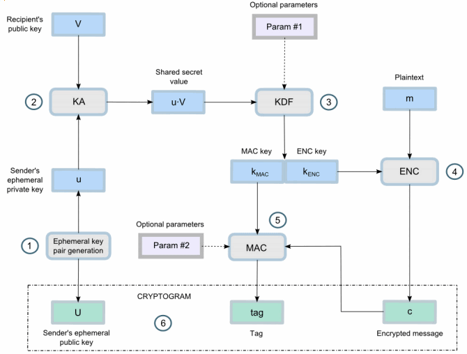

# ECIES Hybrid Encryption Scheme

A hybrid encryption scheme similar to the previously demonstrated code is standardized under the name **Elliptic Curve Integrated Encryption Scheme** (**ECIES**) in many crypto standards like [SECG SEC-1](http://www.secg.org/sec1-v2.pdf), [ISO/IEC 18033-2](https://www.shoup.net/iso/std4.pdf), [IEEE 1363a](http://grouper.ieee.org/groups/1722/contributions/2012/1722a-butterworth-ieee1363.pdf) and [ANSI X9.63](ftp://ftp.iks-jena.de/mitarb/lutz/standards/ansi/X9/x963-7-5-98.pdf). **ECIES** is a public-key authenticated encryption scheme, which works similarly to the above code examples, but uses a **KDF** (key-derivation function) for deriving separate **MAC key** and symmetric **encryption key** from the ECDH shared secret. It has many variants.

The **ECIES standard** combines ECC-based **asymmetric cryptography** with **symmetric ciphers** to provide data encryption by EC private key and decryption by the corresponding EC public key. The **ECIES** encryption scheme uses **ECC** cryptography (public key cryptosystem) + key-derivation function (**KDF**) + **symmetric encryption** algorithm + **MAC** algorithm, combined together like it is shown on the figure below:

The input of the **ECIES encryption** consists of recipient's **public key** + **plain text message**. The output consists of sender's ephemeral public key (**ciphertext public key**) + **encrypted message** (ciphertext + symmetric algorithm parameters) + **authentication tag** (MAC code):

* `ECIES-encrypt(recipientPublicKey, plaintextMessage)` ➔ `{ cipherTextPublicKey, encryptedMessage, authTag }`

The **ECIES decryption** takes the output from the encryption + the **recipient's private key** and produces the original plaintext message or detects a problem (e.g. integrity / authentication error):

* `ECIES-decrypt(cipherTextPublicKey, encryptedMessage, authTag, recipientPrivateKey, )` ➔ `plaintextMessage`

The ECIES encryption scheme is a **framework**, not a concrete algorithm. It can be implemented by plugging different algorithms, e.g. the **secp256k1** or **P-521** elliptic curve for the public-key calculations + **PBKDF2** or **Scrypt** for KDF function + **AES-CTR** or **AES-GCM** or **ChaCha20-Poly1305** for symmetric cipher and authentication tag + **HMAC-SHA512** for MAC algorithm (in case of unauthenticated encryption).

In the next section we shall demonstrate through a **code example** how to use ECIES in practice.
