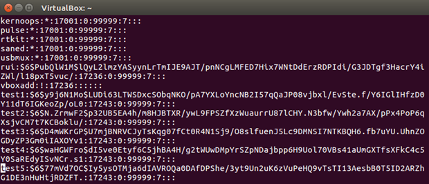
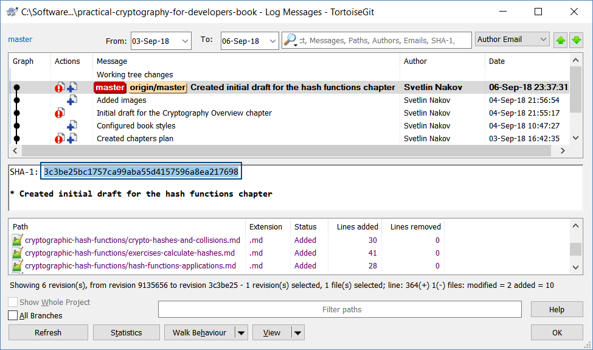

# Hash Functions: Applications

**Cryptographic hash functions** (like SHA-256 and SHA3-256) are used in many scenarios. Let's review their most common applications.

## Document Integrity

Verifying the **integrity** of files / documents / messages. E.g. a **SHA256 checksum** may confirm that certain file is original (not modified after its checksum was calculated).

The above screenshot demonstrates how the **SHA256 checksums** ensure the **integrity** of the OpenSSL files at the official Web site of OpenSSL.

## Storing Passwords

Storing **passwords** and verification of passwords. Instead of keeping a plain-text password in the database, developers usually keep **password hashes** or more complex values derived from the password (e.g. **Scrypt**-derived value).

The above example comes from the `/etc/shadow` file in a modern Linux system. The above passwords are stored as multiple-round SHA-512 hashes with salt.

## Generate Unique ID

Generate an (**almost**) **unique ID** of certain document / message. Cryptographic hash functions almost uniquely identify documents based on their content. In theory **collisions are possible** with any cryptographic hash function, but are very unlikely to happen, so most systems (like **Git**) assume that the hash function they use is **collistion free**.

Usually a document is **hashed** and the **document ID** (hash value) is used later to prove the existence of the document, or to retrieve the document from a storage system. Example of hash-based unique IDs are the commit hashes in **Git** and **GitHub**, based on the content of the commit (e.g. `3c3be25bc1757ca99aba55d4157596a8ea217698`) and the **Bitcoin** addresses (e.g. `1BvBMSEYstWetqTFn5Au4m4GFg7xJaNVN2`).

In the above example the SHA-1 unique ID identifies a certain commit in GitHub.

## Pseudorandom Number Generation

**Pseudorandom generation** and key derivation. Hash values can serve as random numbers. A simple way to generate a random sequence is like this: start from a **random seed** (entropy collected from random events, such like keyboard clicks or mouse moves). Append "**1**" and calculate the hash to obtain the first random number, then append "**2**" and calculate the hash to obtain the second random number, etc. We shall give a Python example, implementing the described idea.

## Proof-of-Work Algorithms

**Proof-of-work** (PoW) algorithms. Most proof-of-work algorithms calculate a hash value which is bigger than certain value (known as mining difficulty). To find this hash value, miners calculate billions of different hashes and take the biggest of them, because hash numbers are unpredictable. For example, the proof of work problem might be defined as follows: find a number `p`, such that `hash(x + p)` holds 10 zero bits at its beginning.

## Cryptographic Hashes are Part of Modern Programming

**Cryptographic hash functions** are so widely used, that they are often implemented as **build-in functions** in the standard libraries for the modern programming languages and platforms.
