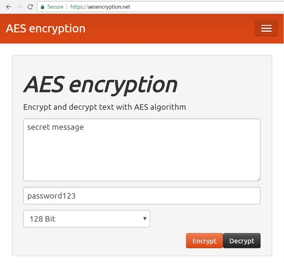

# Cryptography - Overview

## Overview of Modern Cryptography

**Cryptography** has evolved from its first attempts \(thousands years ago\), through the first successful cryptographic algorithms for developers \(like the now retired MD5 and DES\) to modern crypto algorithms \(like SHA-3, Argon2 and ChaCha20\).

Let's first introduce very shortly the basic **cryptography concepts**, that developers should know, like cryptographic **hash functions** \(SHA-256, SHA3, RIPEMD and others\), **HMAC** \(hashed message authentication code\), password to **key derivation** functions \(like **Scrypt**\), the Diffie-Hellman key-exchange protocol, **symmetric key** encryption schemes \(like the **AES** cipher with CBC and CTR block modes\) and **asymmetric key** encryption schemes with public and private keys \(like the **RSA** cipher and elliptic curves-based cryptography / **ECC**, the secp256k1 curve and the Ed25519 cryptosystem\), **digital signatures** and **ECDSA**, as well as the concept of **entropy** and secure **random number** generation and **quantum-safe cryptography**.

### Encrypt / Decrypt Message - Live Demo

As a simple **example**, we shall demonstrate message **encryption** + **decryption** using the **AES** encryption algorithm. Play with this online tool: [https://aesencryption.net](https://aesencryption.net).

We shall learn later that behind this simple **AES encryption**, there are **many algorithms and settings** hidden inside, like password to key-derivation function and its parameters, block cipher mode, cipher initial vector, message authentication code and others.

## What is Cryptography?

**Cryptography** is the science of providing **security** and **protection** of information. It is used everywhere in our digital world: when you open a Web site, send an email or connect to the WiFi network. That's why developers should have **at least basic understanding of cryptography** and how to use crypto algorithms and crypto libraries, to understand hashing, symmetric and asymmetric ciphers and encryption schemes, as well as digital signatures and the cryptosystems and algorithms behind them.

### Encryption and Keys

Cryptography deals with **storing and transmitting data in a secure way**, such that only those, for whom it is intended, can read and process it. This may involve **encrypting and decrypting data** using symmetric or asymmetric encryption schemes, where one or more **keys** are used to transform data from plain to encrypted form and back.

**Symmetric encryption** \(like AES, Twofish and ChaCha20\) uses the same key to encrypt and decrypt messages, while **asymmetric encryption** uses a **public-key cryptosystem** \(like RSA or ECC\) and a key-pair: public key \(encryption key\) and corresponding private key \(decryption key\). Encryption algorithms are often combined in encryption schemes \(like AES-256-CTR-HMAC-SHA-256, ChaCha20-Poly1305 or ECIES-secp256k1-AES-128-GCM\).

Cryptography deals with **keys** \(large secret numbers\) and in many scenarios these **keys are derived** from numbers, passwords or passphrases using **key derivation algorithms** \(like PBKDF2 and Scrypt\).

### Digital Signatures and Message Authentication

Cryptography provides means of **digital signing of messages** which guarantee message authenticity, integrity and non-repudiation. Most digital signature algorithms \(like DSA, ECDSA and EdDSA\) use **asymmetric key pair** \(private and public key\): the message is **signed** by the private key and the signature is **verified** by the corresponding public key. In the bank systems **digital signatures** are used to sign and approve payments. In blockchain signed transactions allow users to transfer a blockchain asset from one address to another.

Cryptography deals with **message authentication** algorithms \(like HMAC\) and message authentication codes \(MAC codes\) to prove message authenticity, integrity and authorship. Authentication is used side by side with encryption, to ensure secure communication.

### Secure Random Numbers

Cryptography uses **random numbers** and deals with **entropy** \(unpredictable randomness\) and secure generation of random numbers \(e.g. using CSPRNG\). **Secure random numbers** are unpredictable by nature and developers should care about them, because broken random generator means compromised or hacked system or app.

### Key Exchange

Cryptography defines **key-exchange algorithms** \(like Diffie-Hellman key exchange and ECDH\) and **key establishment schemes**, used to securely establish encryption **keys** between two parties that intend to transmit messages securely using **encryption**. Such algorithms are performed typically when a new secure connection between two parties is established, e.g. when you open a modern Web site or connect to the WiFi network.

### Cryptographic Hashes and Password Hashing

Cryptography provides **cryptographic hash functions** \(like SHA-3 and BLAKE2\), which transform messages to **message digest** \(hash of fixed length\), which cannot be reversed back to the original message and almost uniquely identifies the input. In **blockchain** systems, for example, hashes are used to generate blockchain addresses, transaction ID and in many other algorithms and protocols. In **Git** cryptographic hashes are used for generating unique ID for files and commits.

**Password hashing** and password to **key derivation functions** \(like Scrypt and Argon2\) protect user passwords and password encrypted documents and data by securely deriving a hash \(or key\) from a text-based passwords, injecting random parameters \(salt\) and using a lot of iterations and computing resources to make password cracking slow.

### Confusion and Diffusion in Cryptography

In cryptography the hashing, encryption algorithms and random generators follow the Shannon's principles of[ confusion and diffusion](https://en.wikipedia.org/wiki/Confusion_and_diffusion). **Confusion** means that each bit in the output form a cipher should depend on several parts of the key and input data and thus direct mapping cannot be established. **Diffusion** means that changing one bit in the input should change approximately half of the bits in the output. These principles are incorporated in most hash functions, MAC algorithms, random number generators, symmetric and asymmetric ciphers.

### Cryptographic Libraries

Developers should know the modern **cryptographic libraries** for their programming language and platform and how to use them. Developing with cryptography requires **understanding of the crypto-concepts**. Copy / pasting code from Internet or following an example from a blog may lead to insecure design and weak security. Cryptographic libraries are very useful, but you should **understand the concepts** first, then choose appropriate combination of algorithms and adjust carefully their parameters.

