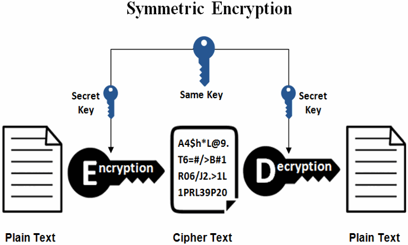
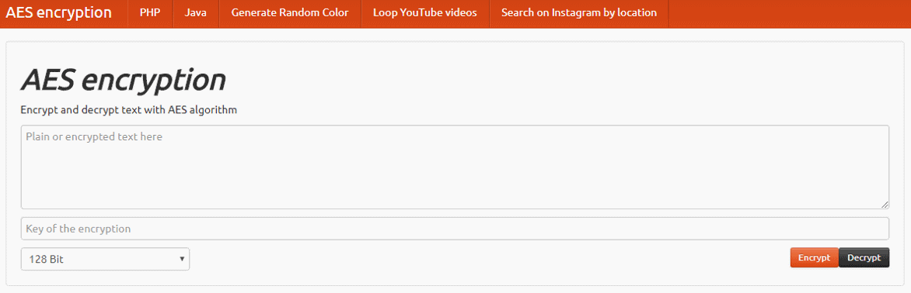
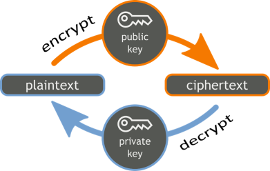
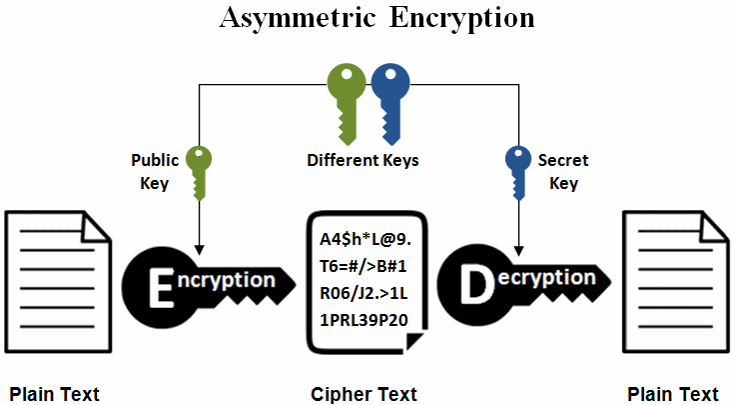
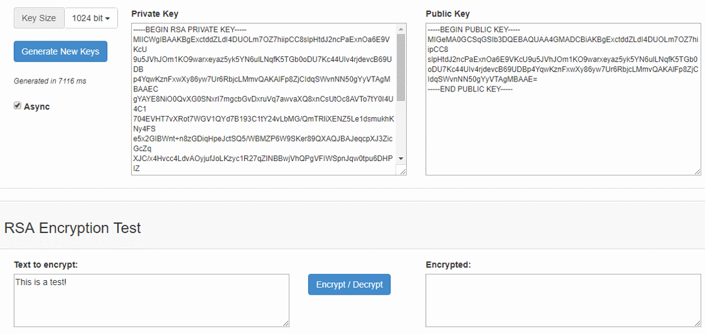

# Encryption: Symmetric and Asymmetric

In cryptography two major types of encryption schemes are widely used: **symmetric encryption** \(where a single **secret key** is used to encrypt and decrypt data\) and **asymmetric encryption** \(where a public key cryptosystem is used and encryption and decryption is done using a **pair of public and corresponding private key**\). Let's explain these fundamental crypto-concepts in details.

## Symmetric Encryption - Concepts and Algorithms

**Symmetric encryption** schemes use **the same symmetric key** \(or password\) to **encrypt** data and **decrypt** the encrypted data back to its original form:



Symmetric encryption usually combines several crypto algorithms into an **symmetric encryption scheme**, e.g. AES-256-CTR-HMAC-SHA256. The **encryption scheme** \(cipher construction\) may include: password to **key derivation** algorithm \(with certain parameters\) + **symmetric cipher** algorithm \(with certain parameters\) + **cipher block mode** algorithm + **message authentication** \(MAC\) algorithm. This means that **the above shown diagram is simplified** and does not fully represent the process.

### Secret Keys

The **secret key** used to **cipher** \(encrypt\) and **decipher** \(decrypt\) data is typically of size 128, 192 or 256 bits and is sometimes referred as "_**encryption key**_" or "_**shared key**_", because both sending and receiving parties should know it.

Most applications use a [**password-to-key-derivation**](https://github.com/svetlin-nakov/practical-cryptography-for-developers/tree/34666e7576d7427e08bf3940a69214b0cda94676/content/part-1-blockchain-networks-concepts/blockchain-cryptography/blockchain-cryptography-overview/hmac-and-key-derivation.html) scheme to extract a **secret key** from certain **password**, because users tend to remember passwords easier than binary data. Additionally, **message authentication** is often incorporated along with the encryption to provide **integrity** and **authenticity** \(this encryption approach is known as "[**authenticated encryption**](https://en.wikipedia.org/wiki/Authenticated_encryption)"\).

How does a **private key** look like? Let's start from a simple example of **256-bit secret key**, encoded as [**hex string**](https://en.wikipedia.org/wiki/Hexadecimal):

```text
02c324648931b89e3e8a0fc42c96e8e3be2e42812986573a40d46563bceaf75110
```

In many systems \(e.g. public blockchains, PGP, OpenSSL and others\) secret keys are encoded as [**base58**](https://en.wikipedia.org/wiki/Base58) or [**base64**](https://en.wikipedia.org/wiki/Base64) for shorter string representation.

For example, the above key looks like this in **base58**:

```text
pbPRqYDxnKZfs8j4KKiqYmx6nzipAjTJf1oCD1WKgy99
```

The same key looks like this in **base64**:

```text
AsMkZIkxuJ4+ig/ELJbo474uQoEphlc6QNRlY7zq91EQ
```

In **decimal** system, the above key is the following integer number:

```text
319849484316084980661994213716306415989897600164422912728298459349458028548368
```

### Modern Symmetric Encryption Algorithms

Widely used in modern cryptography **symmetric encryption algorithms** \(ciphers\) are: [**AES**](https://en.wikipedia.org/wiki/Advanced_Encryption_Standard) \(AES-128, AES-192, AES-256\), [**ChaCha20**](https://legacy.gitbook.com/book/svetlin-nakov/practical-blockchain-for-developers-the-big-book/edit#), [**Twofish**](https://en.wikipedia.org/wiki/Twofish), [**IDEA**](https://en.wikipedia.org/wiki/International_Data_Encryption_Algorithm), [**Serpent**](https://en.wikipedia.org/wiki/Serpent_%28cipher%29), [**Camelia**](https://en.wikipedia.org/wiki/Camellia_%28cipher%29) and others. Most of them are **block ciphers** \(encrypt data by blocks of fixed size, e.g. 128 bits\), while others are **stream ciphers** \(encrypt data byte by byte as a stream\). Block ciphers can be turned into stream ciphers by using a technique called "**cipher block mode**".

We shall give more details and code examples using the **AES** and **ChaCha20** algorithms a bit later.

### Symmetric Encryption - Online Demo

In order to better understand the idea behind the symmetric encryption, you can play with some **online symmetric encryption tool** to encrypt and decrypt a sample message by sample secret key \(or password\). You can play a bit with this site: [**https://aesencryption.net**](https://aesencryption.net).



It demonstrates how we can encrypt and decrypt messages, using the **AES cipher** \(with certain settings, more precisely AES-128-CBC\) and certain password-to-key-derivation function. In the above example if we encrypt the text "_**secret msg**_" by the password "_**p@ss**_", we will get the [base64-encoded](https://en.wikipedia.org/wiki/Base64) binary data "_**jVJwOBmH+qMqHdg22KwMyg==**_" as output. After decryption with the same secret key we get back the original text "_**secret msg**_".

Note that the above encrypted text is dependent to many algorithm parameters and settings, so if you encrypt the same at another "_AES live example_" Web site, the result most likely will be different.

Also note that the above mentioned Web site uses bad practices, old algorithms and weak cipher settings, so don't follow the code examples there.

## Public Key Cryptography - Concepts

Before introducing the **asymmetric key encryption** schemes and algorithms, we should first understand the concept of **public key cryptography** \(asymmetric cryptography\).

The [**public key cryptography**](https://en.wikipedia.org/wiki/Public-key_cryptography) uses a different key to encrypt and decrypt data \(or to sign and verify messages\). Keys always come as **public + private key pairs**. **Asymmetric cryptography** deals with **encrypting** and **decrypting** messages using a public / private key, **signing** messages, **verifying** signatures and securely **exchanging keys**.

Popular **public-key cryptosystems** \(asymmetric crypto algorithms\) like **RSA** \(Rivest–Shamir–Adleman\), **ECC** \(elliptic curve cryptography\), **Diffie-Hellman**, **ECDH**, **ECDSA** and **EdDSA**, are widely used in the modern cryptography and we shall demonstrate most of them in practice with code examples.

### Public Key Encryption / Decryption

**Asymmetric encryption schemes** use a pair of cryptographically related **public** and **private keys** to **encrypt** the data \(by the public key\) and **decrypt** the encrypted data back to its original forms \(by the private key\). Data **encrypted by a public key** is **decrypted** by the corresponding **private key**:



The encrypted data, obtained as result of encryption is called "**ciphertext**". The ciphertext is a binary sequence, unreadable by humans and by design cannot be decrypted without the decryption key.



Note that **the above shown diagram is highly simplified** and does not fully represent the asymmetric encryption / decryption process. Typically, public-key cryptosystems can **encrypt messages of limited length** only and are slower than symmetric ciphers. For encrypting longer messages \(e.g. PDF documents\) usually a **public-key encryption scheme** \(also known as **hybrid encryption scheme**\) is used, which combines **symmetric** and **asymmetric encryption** like this:

* For the **encryption** a random symmetric key `sk` is generated, the message is symmetrically encrypted by `sk`, then `sk` is asymmetrically encrypted using the recipient's public key.
* For **decryption**, first the `sk` key is asymmetrically decrypted using the recipient's private key, then the ciphertext is decrypted symmetrically using `sk`.

The above process is known as [**key encapsulation mechanism \(KEM\)**](https://en.wikipedia.org/wiki/Key_encapsulation): encapsulate an asymmetrically-encrypted random \(ephemeral\) symmetric key and use symmetric algorithm for the data encryption.

Public key encryption can work also in the opposite scenario: **encrypt data by a private key and decrypt it by the public key**. Thus someone can prove that he is owner of certain private key, while revealing only its corresponding public key. This approach is used by some digital signature schemes.

### Signatures: Asymmetric Signing / Verification

In the context of [**digital signatures**](https://en.wikipedia.org/wiki/Digital_signature), a message **signed by a private key** \(digital signature\) is later **verified** by the corresponding **public key**.


[**Digital signatures**](digital-signatures/) will be explained in more details later, but in short: a message can be **signed** by certain **private key** and the obtained **signature** can be later **verified** by the corresponding **public key**. A **signed message** cannot be altered after signing. A message signature proves that certain message \(e.g. blockchain transaction\) is created by the owner of certain public key. Digital signatures provide message **authentication**, message **integrity** and **non-repudiation**.

Digital signatures are widely used in the **finance industry** for authorizing payments. In **operating systems** OS components and device drivers are usually digitally signed to avoid injecting insecure code, trojans or viruses in the OS. In **blockchain systems**, transactions are typically signed by the owner of certain blockchain address \(which corresponds to certain public key and has corresponding private key\). So **a signed blockchain transaction holds a proof of authorship**: it is guaranteed mathematically that the signature is created by the holder of certain blockchain address and the transaction was not modified after the signing. This works perfectly for the scenario of **digital payments** and digital signing of documents and contracts.

### Key Pairs

The **public key cryptography** uses a **pair of keys**: **public key** + **private key**. These keys are mathematically connected and are used together as a **pair**.

In some public key cryptosystems \(like the Elliptic-Curve Cryptography - **ECC**\), the public key can be calculated from the private key. In other cryptosystems \(like **RSA**\), the public key and the private key are generated together but cannot be directly calculated from each other.

Usually, a **public / private key pair** is randomly generated in a secure environment \(e.g. in a hardware wallet\) and the public key is revealed, while the private key is securely stored in a crypto-wallet and is protected by a password or by multi-factor authentication.

**Example** of 256-bit private key and its corresponding 256-bit public key \(based on **secp256k1** curve\):

```text
privKey: 648fc1fa828c7f185d825c04a5b21af9e473b867eeee1acea4dbab938433e158
pubKey: 02c324648931b89e3e8a0fc42c96e8e3be2e42812986573a40d46563bceaf75110
```

### Private Keys

Message **encryption** and **signing** is done by a **private key**. The private keys are always kept **secret** by their owner, just like passwords. In the server infrastructure, private keys usually stay in an encrypted and protected **keystore**. In the blockchain systems the private keys usually stay in specific software or hardware apps or devices called "**crypto wallets**", which securely store a set of private keys.

**Example** of 256-bit private key:

```text
648fc1fa828c7f185d825c04a5b21af9e473b867eeee1acea4dbab938433e158
```

### Public Keys

Message **decryption** and **signature verification** is done using the **public key**. Public keys are by design public information \(not a secret\). It is mathematically infeasible to calculate the private key from its corresponding public key.

In many systems the **public key** is encapsulated in a **digital certificate**, which binds a certain identity \(e.g. person or Internet domain name\) to a certain public key. In blockchain systems public keys are usually published as parts of the blockchain transactions to help identify who has signed each transaction. In systems like PGP and SSH the public key is downloaded from the server once \(after manual user verification\) and is remembered for further use.

**Example** of 256-bit public key:

```text
02c324648931b89e3e8a0fc42c96e8e3be2e42812986573a40d46563bceaf75110
```

In most blockchain systems the **blockchain address** is derived from the public key \(by hashing and other transformations\), so if you have someone's public key, you are assumed to have his blockchain address as well.

A certain **public key** can be connected to a certain **person** or **organization** or is used anonymously. You can never know who is the owner of the private key, corresponding to certain public key, unless you have additional proof, e.g. a [**digital certificate**](https://en.wikipedia.org/wiki/Public_key_certificate).

## Popular Public Key Cryptosystems

**Public key cryptosystems** provide a mathematical framework and algorithms to generate public + private key pairs, to **sign**, **verify**, **encrypt** and **decrypt** messages and **exchange keys**, in a cryptographically secure way.

Well-known public-key cryptosystems are: [**RSA**](https://en.wikipedia.org/wiki/RSA_%28cryptosystem%29), [**ECC**](https://en.wikipedia.org/wiki/Elliptic-curve_cryptography) and [**ElGamal**](https://en.wikipedia.org/wiki/ElGamal_encryption). Many **crypto algorithms** are based on the primitives from these cryptosystems like **RSA sign**, **RSA encrypt / decrypt**, **ECDH** key exchange and **ECDSA** and **EdDSA** signatures.

### The RSA Cryptosystem

The [**RSA public-key cryptosystem**](https://en.wikipedia.org/wiki/RSA_%28cryptosystem%29) is based on the math of **modular exponentiations** \(numbers raised to a power by modulus\) and some additional assumptions, together with the computational difficulty of the [**integer factorization problem**](https://en.wikipedia.org/wiki/RSA_problem). We shall discuss it later in detail, along with examples.

### The ECC Cryptosystem

The [**elliptic-curve cryptography \(ECC\) public-key cryptosystem**](https://en.wikipedia.org/wiki/Elliptic-curve_cryptography) is based on the math of the on the algebraic structure of the **elliptic curves** over finite fields and the difficulty of the [**elliptic curve discrete logarithm problem \(ECDLP\)**](https://en.wikipedia.org/wiki/Elliptic-curve_cryptography#Rationale). The **ECC** usually comes together with the [**ECDSA** algorithm](https://en.wikipedia.org/wiki/Elliptic_Curve_Digital_Signature_Algorithm) \(elliptic-curve digital signature algorithm\). We shall discuss ECC and ECDSA in detail, along with examples.

### ECC is Recommended in the General Case

**ECC uses smaller keys**, ciphertexts and signatures than RSA and is recommended for most applications. It is mathematically proven that a **3072-bit RSA key** has similar cryptographic strength to a **256-bit ECC key**. Key generation in ECC is significantly faster than with RSA.

Due to the above reasons most blockchain networks \(like Bitcoin and Ethereum\) use elliptic-curve-based cryptography \(ECC\) to secure the transactions.

Note that both **RSA** and **ECC** cryptosystems are **not quantum-safe**, which means that if someone has enough powerful quantum computer, he will be able to derive the private key from given public key in just a few seconds.

## Asymmetric Encryption in Practice

**Asymmetric encryption** works for **small messages** only \(limited by the public / private key length\). To encrypt larger messages [**key encapsulation mechanisms**](https://en.wikipedia.org/wiki/Key_encapsulation) or other techniques can be used, which encrypt asymmetrically a random secret key, then use it to symmetrically encrypt the larger messages. In practice, modern **asymmetric encryption schemes** involve using a symmetric encryption algorithm together with a public-key cryptosystem, key encapsulation and message authentication.

Popular **asymmetric encryption schemes** are: [**RSA-OAEP**](https://en.wikipedia.org/wiki/Optimal_asymmetric_encryption_padding) \(based on RSA and OAEP padding\), [**RSAES-PKCS1-v1\_5**](https://tools.ietf.org/html/rfc3447#section-7.2) \(based on RSA and PKCS\#1 v1.5 padding\), [**DLIES**](https://en.wikipedia.org/wiki/Integrated_Encryption_Scheme) \(based on discrete logarithms and symmetric encryption\) and [**ECIES**](https://en.wikipedia.org/wiki/Integrated_Encryption_Scheme) \(based on elliptic curve cryptography and symmetric encryption\).

### Asymmetric Encryption - Online Demo

In order to better understand the idea behind the **asymmetric encryption**, you can play with some online public key encryption tool to encrypt / decrypt a sample message by sample RSA private / public key. You can play a bit with this site: [http://travistidwell.com/jsencrypt/demo/](http://travistidwell.com/jsencrypt/demo/).



In the above online demo you can **generate RSA public / private key pairs** and **encrypt** / **decrypt** text messages. Note that **the message size is limited** by the key length, so you can't encrypt long text. You will get an error if you try. Internally, the above Web site uses the **RSAES-PKCS1-v1\_5** public key encryption scheme as specified in [RFC3447](https://tools.ietf.org/html/rfc3447).

We shall discuss the **RSA** and **ECC** cryptosystems in details in the next few chapters. Now, it is important to learn that **symmetric and asymmetric cryptosystems work differently** and are used in different scenarios.

