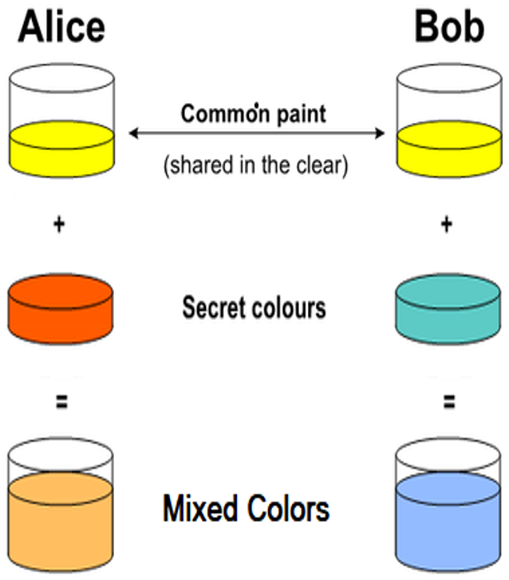
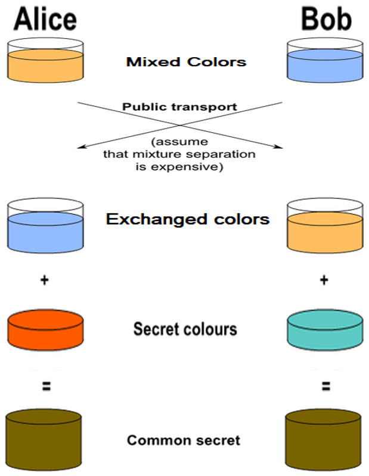
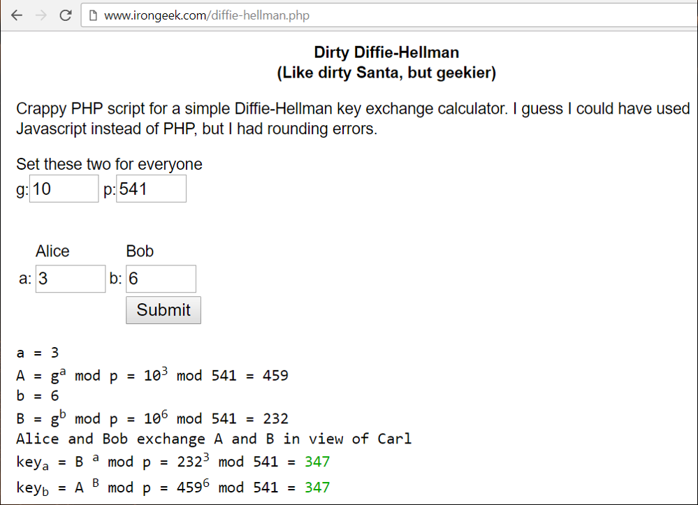

# Diffie–Hellman Key Exchange

## Diffie–Hellman Key Exchange (DHKE)

[**Diffie–Hellman Key Exchange**](https://en.wikipedia.org/wiki/Diffie%E2%80%93Hellman\_key\_exchange) (DHKE) is a cryptographic method to **securely exchange cryptographic keys** (key agreement protocol) over a public (insecure) channel in a way that overheard communication does not reveal the keys. The exchanged keys are used later for encrypted communication (e.g. using a symmetric cipher like AES).

**DHKE** was one of the first **public-key protocols**, which allows two parties to exchange data securely, so that if someone sniffs the communication between the parties, the information exchanged cannot be revealed.

The Diffie–Hellman (DH) method is **anonymous key agreement scheme**: it allows two parties that have no prior knowledge of each other to jointly establish a **shared secret key over an insecure channel**.

Note that the DHKE method is **resistant to** [**sniffing attacks**](https://en.wikipedia.org/wiki/Sniffing\_attack) (data interception), but it is vulnerable to [**man-in-the-middle attacks**](https://en.wikipedia.org/wiki/Man-in-the-middle\_attack) (attacker secretly relays and possibly **alters the communication** between two parties).

The **Diffie–Hellman Key Exchange** protocol can be implemented using **discrete logarithms** (the classical [**DHKE**](https://en.wikipedia.org/wiki/Diffie%E2%80%93Hellman\_key\_exchange) algorithm) or using **elliptic-curve cryptography** (the [**ECDH**](https://en.wikipedia.org/wiki/Elliptic-curve\_Diffie%E2%80%93Hellman) algorithm).

### Key Exchange by Mixing Colors

The Diffie–Hellman Key Exchange protocol is very similar to the concept of "**key exchanging by mixing colors**", which has a good visual representation, which simplifies its understanding. This is why we shall first explain how to exchange a secret color by **color mixing**.

The design of color mixing key exchange scheme assumes that if we have two liquids of different colors, we can **easily mix the colors** and obtain a new color, but the reverse operation is almost impossible: **no way to separate the mixed colors** back to their original color components.

This is the color exchange **scenario**, step by step:

* **Alice** and **Bob**, agree on an arbitrary **starting (shared) color** that does not need to be kept secret (e.g. _yellow_).
* **Alice** and **Bob** separately select a **secret color** that they keep to themselves (e.g. _red_ and _sea green_).
* Finally **Alice** and **Bob** **mix** their secret color together with their mutually shared color. The obtained mixed colors area ready for public exchange (in our case _orange_ and _light sky blue_).

The next steps in the color exchanging scenario are as follows:

* **Alice** and **Bob** publicly **exchange** their two **mixed colors**.
  * We assume that there is no efficient way to extract (separate) the secret color from the mixed color, so third parties who know the mixed colors cannot reveal the secret colors.
* Finally, **Alice** and **Bob** mix together the color they received from the partner with their own secret color.
  * The result is the **final color mixture** (_yellow-brown_) which is identical to the partner's color mixture.
  * It is the **securely exchanged shared key**.

If a third parties have intercepted the color exchanging process, it would be computationally difficult for them to determine the secret colors.

The **Diffie-Hellman Key Exchange** protocol is based on similar concept, but uses [**discrete logarithms**](https://en.wikipedia.org/wiki/Discrete\_logarithm) and [**modular exponentiations**](https://en.wikipedia.org/wiki/Modular\_exponentiation) instead of color mixing.

## The Diffie-Hellman Key Exchange (DHKE) Protocol

Now, let's explain how the **DHKE** protocol works.

### The Math behind DHKE

**DHKE** is based on a simple property of [**modular exponentiations**](https://en.wikipedia.org/wiki/Modular\_exponentiation):

(**ga**)**b** mod **p** = (**gb**)**a** mod **p**

where **g**, **a**, **b** and **p** are positive integers.

If we have **A** = **ga** mod **p** and **B** = **gb** mod **p**, we can calculate **gab** mod **p**, without revealing **a** or **b** (which are called **secret exponents**).

In computing theory, these is no efficient algorithm which can find a secret exponent. If we have **m**, **g** and **p** from the below equation:

**m** = **gs** mod **p**

there is no efficient (fast) algorithm to find the secret exponent **s**. This is known as the [Discrete Logartihm Problem (DLP)](https://en.wikipedia.org/wiki/Discrete\_Logarithm\_Problem\_\(DLP\)).

### Discrete Logarithm Problem (DLP)

The **Discrete Logarithm Problem (DLP)** in computer science is defined as follows:

* By given element _**b**_ and value _**a**_ = _**bx**_ find the exponent _**x**_ (if it exists)

The exponent _**x**_ is called [**discrete logarithm**](https://en.wikipedia.org/wiki/Discrete\_logarithm), i.e. **x** = _log_**b**(**a**). The elements _**a**_ and _**b**_ can be simple integers modulo _**p**_ (from the [group ℤ/pℤ](https://en.wikipedia.org/wiki/Multiplicative\_group\_of\_integers\_modulo\_n)) or elements of [finite cyclic multiplicative group **G**](https://en.wikipedia.org/wiki/Cyclic\_group) (modulo _**p**_), where _**p**_ is typically a prime number.

In cryptography, many algorithms rely on the **computational difficulty of the DLP problem** over carefully chosen group, for which **no efficient algorithm exists**.

### The DHKE Protocol

Now, after we are familiar with the above mathematical properties of the modular exponentiations, we are ready to explain **the DHKE protocol**. This is how it works:

Let's explain each step of this key-exchange process:

* Alice and Bob agree to use two public integers: **modulus p** and **base g** (where **p** is [prime](https://en.wikipedia.org/wiki/Prime\_number), and **g** is a [primitive root modulo](https://en.wikipedia.org/wiki/Primitive\_root\_modulo\_n) **p**).
  * For example, let **p** = 23 and **g** = 5.
  * The integers **g** and **p** are public, typically hard-coded constants in the source code.
* Alice chooses a **secret integer a** (e.g. **a** = 4), then calculates and sends to Bob the number **A = ga mod p**.
  * The number **A** is public. It is sent over the public channel and its interception cannot reveal the secret exponent **a**.
  * In our case we have: **A** = 54 mod 23 = 4.
* Bob chooses a **secret integer b** (e.g. **b** = 3), then calculates and sends to Alice the number **B = gb mod p**.
  * In our case we have: **B** = 53 mod 23 = 10
* Alice computes s = Ba mod p
  * In our example: **s** = 104 mod 23 = **18**
* Bob computes s = Ab mod p
  * In our example: **s** = 43 mod 23 = **18**
* Alice and Bob now share a **secret number s**
  * **s** = Ab mod p = Ba mod p = (ga)b mod p = (gb)a mod p = gab mod p = **18**
  * The shared secret key **s** cannot be computed from the publicly available numbers **A** and **B**, because the secret exponents **a** and **b** cannot be efficiently calculated.

In the most common implementation of DHKE (following the [RFC 3526](https://tools.ietf.org/html/rfc3526)) the base is **g** = **2** and the modulus **p** is a large **prime number** (1536 ... 8192 bits).

### Security of the DHKE Protocol

The DHKE protocol is based on the practical difficulty of the [Diffie–Hellman problem](https://en.wikipedia.org/wiki/Diffie%E2%80%93Hellman\_problem), which is a variant of the well known in the computer science [DLP (discrete logarithm problem)](https://en.wikipedia.org/wiki/Discrete\_Logarithm\_Problem\_\(DLP\)), for which no efficient algorithm still exists.

DHKE exchanges a **non-secret sequence of integer numbers** over insecure, public (sniffable) channel (such as signal going through a cable or propagated by waves in the air), but does not reveal the secretly-exchanged shared private key.

Again, be warned that DHKE protocol in its classical form is **vulnerable to** [**man-in-the-middle attacks**](https://en.wikipedia.org/wiki/Man-in-the-middle\_attack), where a hacker can intercept and modify the messages exchanged between the parties.

Finally, note that the integers **g**, **p**, **a** and **p** are typically very big numbers (1024, 2048 or 4096 bits or even bigger) and this makes the [**brute-force attacks**](https://en.wikipedia.org/wiki/Brute-force\_attack) non-sense.

### DHKE - Live Example

As live example, you can play with this online DHKE tool: [http://www.irongeek.com/diffie-hellman.php](http://www.irongeek.com/diffie-hellman.php)

### ECDH - Elliptic Curves-based Diffie-Hellman Key Exchange Protocol

The [**Elliptic-Curve Diffie–Hellman (ECDH)**](https://en.wikipedia.org/wiki/Elliptic-curve\_Diffie%E2%80%93Hellman) is an anonymous key agreement protocol that allows two parties, each having an **elliptic-curve public–private key pair**, to establish a shared secret over an insecure channel.

**ECDH** is a variant of the classical **DHKE** protocol, where the **modular exponentiation** calculations are replaced with **elliptic-curve** calculations for improved security. We shall explain in details the **elliptic-curve cryptography (ECC)** section later.
