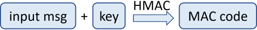
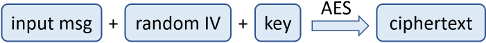

# The AES Cipher - Concepts

The [**Advanced Encryption Standard \(AES\)**](https://en.wikipedia.org/wiki/Advanced_Encryption_Standard) cipher, also known as "**Rijndael**" is a popular, secure, widely used **symmetric key block cipher** algorithm, used officially as recommended encryption technology standard in the United States. **AES** operates using **block size of 128 bits** and symmetric **keys of length** **128**, **160**, **192**, **224** and **256** bits.

## AES is Secure and Very Popular Symmetric Encryption Algorithm

The **AES** symmetric encryption algorithm is considered **highly secure** \(when configured correctly\) and no significant practical attacks are known for AES in its history.

**AES** is used internally by the most Internet Web sites today for serving `https://` content as part of the **TLS** \(Transport Layer Security\) and **SSL** \(Secure Sockets Layer\) standards for secure host to host communication on the Web.

Due to its wide use in the Internet secure communication, modern CPU hardware implements **AES instructions** at the microprocessor level to speed-up the AES encryption and decryption.

## AES Algorithm Parameters

The **AES** algorithm can operate with different **key lengths**, but the block size is always 128 bits. For most application **128-bit AES** encryption \(AES-128\) is enough, but for higher encryption level, it is recommended to use **AES-256** \(256-bit key length\).

Like any other block ciphers, **AES** can use one of several **modes of operation** \(CBC, ECB, CTR, …\) to allow encryption of data of arbitrary length. The recommended mode for the general case and for encrypting blockchain wallets is "**CTR**".

Most modes of operation require an **initial vector** \(IV\). When using a counter mode \(CTR\), i.e. **AES-128-CTR** \(128-bit\) or **AES-256-CTR** \(256-bit\) for example, first a non-secret **random salt** \(IV\) should be generated and saved along with the encrypted ciphertext output. The **size of the IV** is always the same as the size of the block, i.e. **128 bits** \(16 bytes\).

The **AES encryption**, combined with **CTR** block mode and random **IV** causes the encryption algorithm to produce different encrypted ciphertext each time, when the same input data is encrypted. This ensures that nobody can construct a dictionary to reverse back the encrypted ciphertext.

**AES** encryption in **CBC mode** uses a **padding algorithm** \(like **PKCS7** or **ANSI X.923**\) to help splitting the input data into blocks of fixed block-size \(e.g. 128 bits\) before passing the blocks to the AES-CBC algorithm. Most developers use the **CTR mode** of operation for AES, so they don't need padding.

Without using a block mode, the **ciphertext**, generated by the **AES** algorithm is exactly **128 bits** \(16 bytes\), just like the block size. The **input data** is also exactly 128 bits.

The **ciphertext**, generated by the **AES-CTR** algorithm \(AES in CTR cipher block mode\) has the same size like the size of the input data. No padding is required.

The **ciphertext**, generated by the **AES-CBC** algorithm \(AES in CBC ciphertext mode\), has size of **128 bits** \(16 bytes\) or multiple of 128 bits. The input data should be **padded** before encryption and **unpadded** after decryption.

The AES algorithm often is used along with a **password-to-key derivation** function, e.g. `Scrypt(passwd) -> key` or `PBKDF2(passwd) -> key`.

## Integrated Message Authentication Code \(MAC\)

The **AES** algorithm may use **MAC \(message authentication code\)** to check the password validity, e.g. `HMAC(text, key)`.

The **MAC code** is typically **integrated** \(see the concept of [**integrated encryption**](https://en.wikipedia.org/wiki/Authenticated_encryption#Approaches_to_authenticated_encryption)\) in the algorithm's output. It is calculated from the input message, together with the encryption key. From the calculated MAC, it is impossible to reveal the input message or the key, so the MAC itself is not a secret. Some block cipher modes \(like **AES-GCM**\) integrate message authentication in the obtained ciphertext as part of their work, so you don't need to add MAC explicitly.

Typically **MAC** is calculated and used like this:

* Before the encryption, the **MAC** is calculated as: `mac = HMAC-SHA256(input_msg, key)`.
* The **input data is encrypted** and the **ciphertext** is stored along with the **random salt** \(IV\) and the **MAC**.
* After decryption, the **MAC** is calculated again and is **compared** with the **MAC** stored along with the encrypted message.
  * If the MAC is the same, **the decryption is successful**: correct ciphertext + decryption key + algorithms settings \(IV, block mode, padding algorithm\).
  * If the MAC is different, **the decryption is not successful**: incorrect key / password or broken ciphertext, incorrect MAC or different algorithms settings \(IV, block mode, padding, etc.\)

The MAC can be calculated and verified using several [approaches to integrated encryption](https://en.wikipedia.org/wiki/Authenticated_encryption#Approaches_to_authenticated_encryption): **Encrypt-then-MAC**, **Encrypt-and-MAC**, **MAC-then-Encrypt**.

## The AES Encryption Process

The entire **AES encryption** process \(password-based authenticated encryption\) looks like this:

1. **Algorithm parameters** are selected \(e.g. AES, 128-bit, CTR mode + Scrypt + Scrypt parameters + MAC algorithm\). These parameters can be **hard-coded** in the AES algorithm implementation source code or can be specified as input for the AES encrypt and decrypt. Always use the same parameters for encryption and decryption.
2. The encryption **key** is derived from the encryption **password** using a key-derivation function \(**KDF**\), e.g. **Scrypt** \(with certain parameters\):

   

3. The **AES** encryption scheme takes as **input** the **input msg** + the encryption **key**. It produces as output the **ciphertext** + the randomly generated **IV** \(128-bit salt\) + the **MAC** code:

   

   * In case of **authenticated encryption** \(e.g. AES-GCM\), the MAC is already calculated automatically during the AES encryption process.
   * If the encryption scheme is **not authenticated encryption** \(e.g. AER-CTR\), the MAC code is not calculated automatically by the AES encryption process and should be calculated additionally. The **MAC code** can be calculated from the **input msg**, using the encryption **key** \(or some transformation of it\) and some **MAC function** \(like HMAC-SHA-256\):

     

   * The **ciphertext** is calculated through the **AES encryption algorithm**. It first **generates a random salt** \(**IV**\) and uses it to transform the **input msg** using the **encryption key**, through the AES cipher encryption logic:

     

4. Finally, the encrypted output is generated. It holds the **ciphertext** + **IV** + **MAC**. Optionally, it holds also the algorithm settings.

## The AES Decryption Process

The opposite **AES decryption** process \(password-based authenticated decryption\) looks like this:

1. Initialize the same AES **algorithm parameters** for the decryption process, exactly like the ones used during the encryption.
2. Use the decryption **key** and the **IV** from the encrypted message to decrypt the **ciphertext** using the **AES** algorithm decryption logic. The output is the **original message** \(the **input msg**, which was previously passed through AES encryption\):

   

   * In case of **authenticated encryption** \(like AES-GCM\), the integrated **MAC code is verified** during the decryption process.
   * In case of **unauthenticated encryption** \(like AES-CTR\), the MAC code should be calculated and verified additionally, as it is described in the next few step.

3. Calculate **HMAC** of the original message \(obtained during the decryption\):

   

4. Compare the **encryption MAC** \(the MAC of the input message, before the encryption\) with the **decryption MAC** \(the MAC of the original message, recovered by the decryption\):

   

   * If the **MAC codes are the same**, the decryption was correct and the original message is obtained.
   * If the **MAC codes are different**, the decryption was failed and the original message is not the obtained one. This may happen due to many reasons, most likely "_wrong password_". Other reasons: incorrect ciphertext, incorrect IV, incorrect algorithm settings, incorrect KDF function or KDF parameters, etc.

Now it is time to illustrate the above described concepts through working **source code** to AES encrypt / decrypt an **input msg** by given **password**.

